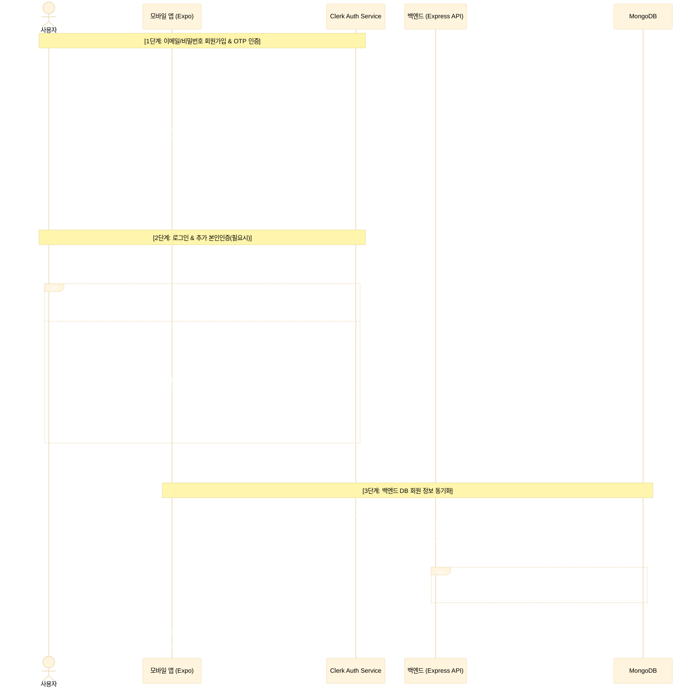

# 🔐 Clerk 인증(Authentication) 도입 및 풀스택(웹/모바일) 연동 가이드

본 문서는 프로젝트에서 **Clerk** 서비스를 활용하여 이메일(Email)과 비밀번호(Password) 기반의 회원가입/로그인을 구현하고, 모바일(Expo) 및 백엔드(Node.js Express + MongoDB) 간에 인증 정보를 완전하게 동기화하기 위한 전체 과정과 트러블슈팅 가이드를 단계별로 상세히 기술합니다.

---

## 📌 전체 흐름 시퀀스 다이어그램

이메일과 비밀번호를 이용해 회원가입(OTP 인증) 및 로그인을 처리하고 백엔드 DB와 연동하는 흐름은 다음과 같습니다.



---

## 1단계. Clerk 공식 사이트(Clerk Dashboard) 설정

이메일/비밀번호 인증이 정상 작동하려면 Clerk 대시보드에서 필수 및 허용 수단을 알맞게 활성화해야 합니다.

1. **프로젝트 생성**:
   - [Clerk Dashboard](https://clerk.com)에서 새로운 Application을 생성합니다.
2. **이메일 및 패스워드 설정 활성화**:
   - **User & Authentication > Sign-up** 메뉴로 이동합니다.
   - **Contact info**에서 **Email address**를 활성화하고, **Required**에 체크하여 회원가입 시 이메일 주소를 필수로 수집하도록 설정합니다.
   - **Authentication factors**에서 **Password**를 활성화하고 **Required**에 체크하여 가입 시 비밀번호 입력을 강제합니다.
3. **이메일 인증(OTP) 활성화**:
   - **User & Authentication > Sign-up** 내 **Verification** 설정에서 이메일 주소 인증 방식으로 **Email code**를 활성화합니다. (가입자가 입력한 이메일로 6자리 핀코드를 발송하는 기능).
4. **API Key 획득**:
   - **API Keys** 메뉴로 이동해 프로젝트에 적용할 키를 복사합니다:
     - **Publishable Key**: `pk_test_...` (프론트엔드 환경 변수에 사용)
     - **Secret Key**: `sk_test_...` (백엔드 `.env` 파일에 사용)

---

## 2단계. 모바일 프론트엔드(Mobile - Expo) 설정 및 구현

모바일 앱에서 이메일/비밀번호 회원가입, 6자리 이메일 코드 인증, 로그인 및 2차 인증을 핸들링하는 네이티브 화면을 구성합니다.

### 1) 네이티브 환경 설정 (`app.json`)
네이티브 모듈(예: SecureStore) 연동 및 iOS 시뮬레이터 구동을 위해 고유한 번들 식별자(`bundleIdentifier`)를 명시해 주어야 합니다.
```json
{
  "expo": {
    "name": "mobile",
    "slug": "mobile",
    "scheme": "mobile",
    "ios": {
      "supportsTablet": true,
      "bundleIdentifier": "com.guniluk.mobile"
    },
    "android": {
      "package": "com.guniluk.mobile",
      "predictiveBackGestureEnabled": false
    },
    "plugins": [
      "expo-router",
      "@clerk/expo",
      "expo-secure-store",
      "expo-web-browser"
    ]
  }
}
```
> [!IMPORTANT]
> iOS 시뮬레이터에서 앱을 띄우려면 `ios.bundleIdentifier`가 필수적입니다. 누락 시 `CommandError: Required property 'ios.bundleIdentifier' is not found` 에러가 발생합니다.

### 2) 안전한 Custom Token Cache 구축 (`app/_layout.tsx`)
세션 토큰을 시뮬레이터 및 실기기 보안 영역에 무한 대기(Pending) 없이 안정적으로 캐싱하도록 `expo-secure-store`를 활용하여 구성합니다.
```typescript
import * as SecureStore from "expo-secure-store";

export const tokenCache = {
  async getToken(key: string) {
    try {
      const item = await SecureStore.getItemAsync(key);
      if (item) {
        console.log(`🔑 Token retrieved successfully for key: ${key}`);
      } else {
        console.log(`ℹ️ No token found for key: ${key}`);
      }
      return item;
    } catch (error) {
      console.error("❌ SecureStore get item error: ", error);
      await SecureStore.deleteItemAsync(key).catch(() => {});
      return null;
    }
  },
  async saveToken(key: string, value: string) {
    try {
      console.log(`💾 Saving token for key: ${key}...`);
      await SecureStore.setItemAsync(key, value);
      console.log(`✅ Token saved successfully for key: ${key}`);
    } catch (err) {
      console.error("❌ SecureStore save item error: ", err);
    }
  },
};
```
> [!NOTE]
> 기본 내장 캐시 라이브러리는 시뮬레이터 기기상의 세션 저장(setActive) 시점에 완료를 반환하지 않고 영구 정지(로딩 스핀 고정)되는 버그가 있으므로, 반드시 위와 같이 예외 처리가 반영된 커스텀 `tokenCache`를 사용하십시오.

### 3) 이메일/비밀번호 회원가입 및 OTP 인증 (`sign-up.jsx`)
가입 정보를 입력받아 계정을 사전 등록하고, 이메일로 발송된 6자리 코드를 입력받아 검증을 완료합니다.
```javascript
import React, { useState } from "react";
import { View, Text, TextInput, TouchableOpacity, Alert, ActivityIndicator } from "react-native";
import { useSignUp, useClerk } from "@clerk/expo";
import { useRouter } from "expo-router";

export default function SignUpScreen() {
  const { signUp, isLoaded: isSignUpLoaded } = useSignUp();
  const { setActive } = useClerk();
  const router = useRouter();

  const [email, setEmail] = useState("");
  const [password, setPassword] = useState("");
  const [pendingVerification, setPendingVerification] = useState(false);
  const [verificationCode, setVerificationCode] = useState("");
  const [loading, setLoading] = useState(false);

  // 1단계: 계정 생성 및 인증코드 전송
  const handleSignUp = async () => {
    if (!isSignUpLoaded || !signUp) return;
    setLoading(true);
    try {
      await signUp.create({ emailAddress: email, password });
      await signUp.verifications.sendEmailCode(); // 6자리 메일 발송
      setPendingVerification(true);
      Alert.alert("인증 코드 발송", "이메일로 6자리 인증 코드가 전송되었습니다.");
    } catch (err) {
      const errorMsg = err.errors?.[0]?.message || "회원가입 요청에 실패했습니다.";
      Alert.alert("회원가입 실패", errorMsg);
    } finally {
      setLoading(false);
    }
  };

  // 2단계: OTP 코드 인증 및 최종 가입 완료
  const handleVerify = async () => {
    if (!signUp) return;
    setLoading(true);
    try {
      await signUp.verifications.verifyEmailCode({ code: verificationCode });
      
      // 훅 자체의 signUp.status가 complete가 되었는지 검사
      if (signUp.status === "complete") {
        await setActive({ session: signUp.createdSessionId }); // 세션 활성화 및 토큰 저장
        router.replace("/");
      } else {
        Alert.alert("알림", "가입 상태가 완료되지 않았습니다.");
      }
    } catch (err) {
      const errorMsg = err.errors?.[0]?.message || "잘못된 인증 코드입니다.";
      Alert.alert("인증 실패", errorMsg);
    } finally {
      setLoading(false);
    }
  };

  return (
    <View>
      {!pendingVerification ? (
        // 회원가입 입력 UI
        <View>
          <TextInput placeholder="이메일" value={email} onChangeText={setEmail} autoCapitalize="none" />
          <TextInput placeholder="비밀번호" value={password} onChangeText={setPassword} secureTextEntry autoCapitalize="none" />
          <TouchableOpacity onPress={handleSignUp}>
            <Text>가입하기</Text>
          </TouchableOpacity>
        </View>
      ) : (
        // 6자리 인증 번호 입력 UI
        <View>
          <TextInput placeholder="123456" value={verificationCode} onChangeText={setVerificationCode} keyboardType="number-pad" maxLength={6} />
          <TouchableOpacity onPress={handleVerify}>
            <Text>인증 완료</Text>
          </TouchableOpacity>
        </View>
      )}
    </View>
  );
}
```

### 4) 로그인 및 추가 인증 단계 처리 (`sign-in.jsx`)
아이디/패스워드로 로그인을 시도하고, 가입 시 이메일 인증을 끝마치지 않았거나 추가 인증 절차가 필요하여 `needs_first_factor` 상태가 반환되면 인증 코드를 가로채서 처리합니다.
```javascript
import React, { useState } from "react";
import { View, Text, TextInput, TouchableOpacity, Alert } from "react-native";
import { useSignIn, useClerk } from "@clerk/expo";
import { useRouter } from "expo-router";

export default function SignInScreen() {
  const { signIn, isLoaded: isSignInLoaded } = useSignIn();
  const { setActive } = useClerk();
  const router = useRouter();

  const [email, setEmail] = useState("");
  const [password, setPassword] = useState("");
  const [pendingVerification, setPendingVerification] = useState(false);
  const [verificationCode, setVerificationCode] = useState("");
  const [loading, setLoading] = useState(false);

  // 1단계: 로그인 시도
  const handleSignIn = async () => {
    if (!isSignInLoaded || !signIn) return;
    setLoading(true);
    try {
      const result = await signIn.create({ identifier: email, password });

      // API 결과 중 에러가 있는지 먼저 가드 처리
      const errorObj = result?.error || (result?.errors && result.errors[0]);
      if (errorObj) {
        Alert.alert("로그인 실패", errorObj.message || "비밀번호가 틀렸습니다.");
        return;
      }

      // [핵심] API 반환객체가 아닌 useSignIn 훅 인스턴스(signIn) 자체의 status를 관측!
      if (signIn.status === "complete") {
        await setActive({ session: signIn.createdSessionId });
        router.replace("/");
      } else if (signIn.status === "needs_first_factor") {
        // 이메일 미인증 상태 등의 추가 1차 팩터 요구 시
        const emailFactor = signIn.supportedFirstFactors?.find(
          (factor) => factor.strategy === "email_code"
        );
        if (emailFactor) {
          await signIn.prepareFirstFactor({
            strategy: "email_code",
            emailAddressId: emailFactor.emailAddressId,
          });
          setPendingVerification(true);
          Alert.alert("인증 코드 발송", "로그인 완수를 위해 이메일로 인증코드가 발송되었습니다.");
        }
      } else {
        Alert.alert("알림", `추가 단계가 필요합니다. (상태: ${signIn.status})`);
      }
    } catch (err) {
      Alert.alert("로그인 실패", err.errors?.[0]?.message || "로그인 요청 실패");
    } finally {
      setLoading(false);
    }
  };

  // 2단계: 로그인 추가 인증 코드 검증
  const handleVerify = async () => {
    if (!signIn) return;
    setLoading(true);
    try {
      await signIn.attemptFirstFactor({ strategy: "email_code", code: verificationCode });
      if (signIn.status === "complete") {
        await setActive({ session: signIn.createdSessionId });
        router.replace("/");
      } else {
        Alert.alert("알림", "로그인 상태가 여전히 불완전합니다.");
      }
    } catch (err) {
      Alert.alert("인증 실패", err.errors?.[0]?.message || "잘못된 코드입니다.");
    } finally {
      setLoading(false);
    }
  };

  return (
    // UI 생략 (SignUp과 유사하게 pendingVerification 분기 렌더링)
    <View></View>
  );
}
```
> [!IMPORTANT]
> Clerk JS SDK의 동작 철학상 `signIn.create` 또는 `attemptFirstFactor` 등의 비동기 작업 결과 반환되는 객체(`result`)에는 `{ error: null }` 형식만 반환되고 `status` 필드가 누락되어 있을 수 있습니다. 따라서 실제 인증 라이프사이클의 `status` 및 `createdSessionId`는 반드시 **훅으로부터 획득한 `signIn` 변수 자체**에서 추출해 읽어내야 합니다.

---

## 3단계. 백엔드(Backend) 설정 및 구현

클라이언트에서 획득한 Bearer JWT 세션 토큰을 검증하고 회원가입 정보를 내부 DB(MongoDB)와 안전하게 동기화합니다.

### 1) 백엔드 Clerk 환경 설정 (`backend/.env`)
```env
CLERK_PUBLISHABLE_KEY=pk_test_...
CLERK_SECRET_KEY=sk_test_...
```

### 2) Express 서버에 Clerk 미들웨어 등록 (`server.js`)
```javascript
import express from "express";
import { clerkMiddleware } from "@clerk/express";

const app = express();
app.use(express.json());
app.use(clerkMiddleware()); // 모든 API 요청 헤더의 JWT 서명을 자동 파싱하고 세션 주입
```

### 3) DB 동기화 검증 미들웨어 구축 (`auth.middleware.js`)
모든 API 접근 전 토큰 유효성을 판별하고, DB에 가입되지 않은 신규 Clerk 유저를 MongoDB로 인출하여 회원 가입 동기화를 완료합니다.
```javascript
import { clerkClient } from "@clerk/express";
import { User } from "../models/user.model.js";

export const protectRoute = async (req, res, next) => {
  try {
    const clerkUserId = req.auth.userId; // JWT 해독을 통해 추출된 유저 ID
    if (!clerkUserId) {
      return res.status(401).json({ message: "인증 정보가 만료되었습니다." });
    }

    // 1. MongoDB에서 해당 사용자 조회
    let user = await User.findOne({ clerkId: clerkUserId });

    // 2. 가입되지 않은 유저인 경우 (최초 로그인) Clerk API를 호출하여 DB 가입 처리
    if (!user) {
      const clerkUser = await clerkClient.users.getUser(clerkUserId);
      const email = clerkUser.emailAddresses[0]?.emailAddress;
      const fullName = `${clerkUser.firstName || ""} ${clerkUser.lastName || ""}`.trim() || "사용자";
      const imageUrl = clerkUser.imageUrl;

      user = await User.create({
        clerkId: clerkUserId,
        fullName,
        imageUrl,
        email,
      });
      console.log(`[Sync Success] MongoDB 신규 동기화 완료: ${fullName}`);
    }

    req.currentUser = user; // 후속 라우트 컨트롤러에 주입
    next();
  } catch (error) {
    console.error("인증 검증 에러:", error);
    res.status(500).json({ message: "서버 내부 인증 오류" });
  }
};
```

---

## 4단계. 모바일 API 통신 설계 및 타임아웃 예외 처리 (`index.tsx`)

모바일에서 백엔드 데이터를 가져올 때 잘못된 서버 IP나 일시적인 망 장애로 인해 화면에 로딩 인디케이터가 갇혀 굳어버리는(무한 스핀) 현상을 예방하기 위해, `AbortController`를 이용해 **최대 8초 내외의 네트워크 타임아웃** 방어벽을 추가합니다.

```typescript
import React, { useEffect, useState, useCallback } from "react";
import { View, ActivityIndicator, Alert } from "react-native";
import { useUser } from "@clerk/expo";
import { API_ENDPOINTS } from "../../constants/api";

export default function DashboardScreen() {
  const { user, isLoaded: isUserLoaded } = useUser();
  const [loading, setLoading] = useState(true);

  const fetchTransactions = useCallback(async () => {
    if (!user?.id) return;
    
    const controller = new AbortController();
    const timeoutId = setTimeout(() => controller.abort(), 8000); // 8초 제한 시간

    try {
      const response = await fetch(`${API_ENDPOINTS.transactions}/${user.id}`, {
        signal: controller.signal, // 시그널 바인딩
      });
      clearTimeout(timeoutId);
      
      if (!response.ok) throw new Error("조회 실패");
      const data = await response.json();
      // 데이터 바인딩 로직...
    } catch (error: any) {
      clearTimeout(timeoutId);
      console.error("거래내역 조회 에러:", error);
      if (error.name === "AbortError") {
        console.warn("⚠️ 네트워크 요청이 8초를 초과하여 강제 중단되었습니다.");
      }
    }
  }, [user?.id]);

  const loadAllData = useCallback(async () => {
    setLoading(true);
    await fetchTransactions(); // 기타 API도 함께 호출
    setLoading(false);
  }, [fetchTransactions]);

  useEffect(() => {
    if (isUserLoaded && user?.id) {
      loadAllData();
    }
  }, [isUserLoaded, user?.id, loadAllData]);

  if (!isUserLoaded || !user?.id || loading) {
    return <ActivityIndicator size="large" />;
  }

  return (
    // 대시보드 UI
    <View></View>
  );
}
```

---

## 5단계. 치명적 오류 트러블슈팅 및 예방 체크리스트

### 1) React Native 디버거 가로채기(Network Inspection) 버그
* **현상**: 로그인 시도 시 `result.status`가 `undefined`로 조회되고, 응답 데이터가 `{ "error": null }` 처럼 비정상적인 빈 객체로 수신되는 경우.
* **원인**: Flipper, React DevTools, Chrome Inspect 등의 툴에서 HTTP 네트워크 패킷 가로채기(Network Inspection)가 켜져 있으면, Clerk SDK의 보안 인증 응답 바디를 정상 캡처하지 못하고 런타임 메모리에서 응답 본문을 소멸시켜 버리는 고질적인 버그입니다.
* **조치**: 시뮬레이터 개발자 메뉴(`Cmd + D` 혹은 터미널 `d`)를 열어 **"Stop Debugging"** 또는 **"Disable Network Inspection"**을 활성화해 디버깅 감시 툴을 끈 상태로 구동하십시오.

### 2) 개발 장비 IP 변경 및 SYN_SENT 대기 오류
* **현상**: 모바일 앱 구동 시 로딩 화면(스피너)에 갇힌 채 응답이 전혀 없고, 터미널 소켓 모니터링 시 `SYN_SENT` 대기열이 생성되는 경우.
* **원인**: Wi-Fi 등 네트워크 망 변경으로 개발 장비(PC/Mac)의 실제 로컬 IP 주소가 변경되었으나, 앱의 API 주소 상수가 예전 IP로 하드코딩되어 있어서 패킷을 엉뚱한 목적지로 계속 송신하여 응답을 대기 중인 상태입니다.
* **조치**: 
  1. 맥북 터미널에서 `ifconfig` 명령어로 현재 en0 등 활성 Wi-Fi 어댑터의 IP(예: `192.168.x.x`)를 파악합니다.
  2. `mobile/constants/api.js` 내의 `API_BASE_URL` IP를 해당 값으로 수정합니다.
  3. Metro 번들러가 새 IP를 캐싱하여 무시하는 것을 방지하기 위해 반드시 **캐시 청소 옵션을 달아 메트로 서버를 재기동**합니다:
     ```bash
     npx expo start -c
     ```
  4. 시뮬레이터의 앱을 강제 종료하고 다시 실행합니다.
