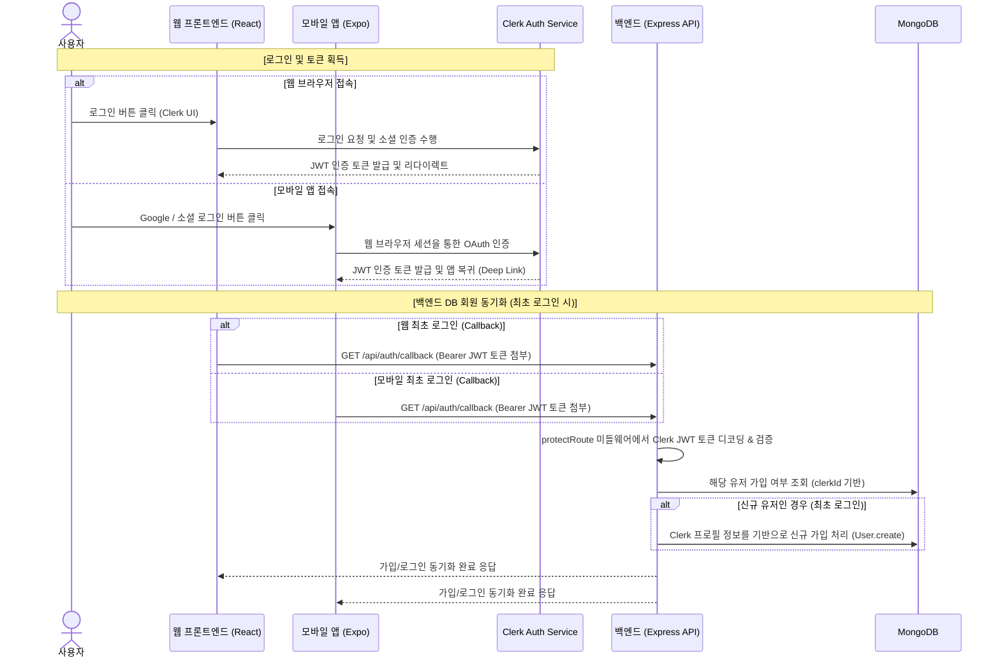

# 🔐 Clerk 인증(Authentication) 도입 및 풀스택(웹/모바일) 연동 가이드

본 문서는 프로젝트에서 **Clerk** 서비스를 활용하여 웹(React)과 모바일(Expo) 프론트엔드를 구축하고, 이를 Node.js Express 백엔드 및 MongoDB 데이터베이스와 동기화하기 위한 전체 과정과 연동 절차를 단계별로 상세히 안내합니다.

---

## 📌 전체 흐름 시퀀스 다이어그램



---

## 1단계. Clerk 공식 사이트(Clerk Dashboard) 설정

풀스택 연동을 시작하기 전에 Clerk 대시보드에서 애플리케이션을 생성하고 API Key를 발급받아야 합니다.

1. **Clerk 가입 및 대시보드 진입**:
   - [Clerk 공식 홈페이지](https://clerk.com)에 회원가입 후 Dashboard로 이동합니다.
2. **신규 프로젝트(Application) 생성**:
   - `Create application` 버튼을 클릭합니다.
   - 애플리케이션 이름(예: `Spotify-Clone`)을 입력합니다.
   - 활성화할 인증 수단을 선택합니다:
     - **Email address** 및 **Google** 소셜 로그인을 선택합니다. (필요 시 Apple 등 추가)
   - `Create Application`을 클릭해 생성을 완료합니다.
3. **API Key 확인 및 복사**:
   - 대시보드의 **API Keys** 메뉴로 이동합니다.
   - 다음 두 가지 키를 별도로 메모해 둡니다:
     - **Publishable Key**: 프론트엔드(웹/모바일)에서 사용할 공개 키 (형식: `pk_test_...`)
     - **Secret Key**: 백엔드(Express)에서 사용할 비밀 키 (형식: `sk_test_...`)
4. **소셜 로그인(OAuth) Redirect URI 설정 (모바일 앱용)**:
   - 모바일 앱에서 Clerk 소셜 로그인을 사용하려면, 앱이 인증 완료 후 되돌아올 **Deep Link Scheme**(예: `myapp://redirect` 또는 `exp://`)을 Clerk Dashboard의 **User & Authentication > Social Connections** 설정 내 **Redirect URL** 혹은 앱 환경 설정에 등록해 주어야 합니다.

---

## 2단계. 웹 프론트엔드(Web Frontend - React) 설정 및 구현

클라이언트 사이드에서 Clerk SDK를 주입하고, 로그인 상태에 따라 UI를 분기하며 토큰을 백엔드로 전달하는 흐름을 잡습니다.

### 1) 의존성 설치
프론트엔드 폴더(`frontend/`) 경로에서 React용 Clerk SDK를 설치합니다.
```bash
cd frontend
npm install @clerk/react
```

### 2) 환경 변수 등록
`frontend/.env.local` 파일을 생성(또는 수정)하고 Clerk 대시보드에서 가져온 Publishable Key를 입력합니다.
```env
VITE_CLERK_PUBLISHABLE_KEY=pk_test_...
```
*(Vite 앱에서는 접두사 `VITE_`가 붙은 변수만 클라이언트 코드에서 인식 가능합니다)*

### 3) 최상위 프로바이더 설정 (`main.tsx` 또는 `App.tsx` 부근)
React 앱 전체에 로그인 세션 상태를 공급하기 위해 `ClerkProvider`로 엔트리포인트를 랩핑해야 합니다.
```typescript
import { ClerkProvider } from "@clerk/react";

const clerkPublishableKey = import.meta.env.VITE_CLERK_PUBLISHABLE_KEY;

if (!clerkPublishableKey) {
  throw new Error("Missing Publishable Key");
}

export const AuthProvider = ({ children }: { children: React.ReactNode }) => {
  return (
    <ClerkProvider publishableKey={clerkPublishableKey}>
      {children}
    </ClerkProvider>
  );
};
```

### 4) 로그인 분기 컴포넌트 활용
Clerk가 제공하는 빌트인 컴포넌트를 사용해 로그인한 유저에게만 특정 메뉴나 페이지를 보여줍니다.
- `<SignedIn>`: 로그인 상태인 유저에게만 자식 요소를 노출합니다.
- `<SignedOut>`: 로그아웃 상태인 유저에게만 자식 요소를 노출합니다.
- `<UserButton>`: Clerk가 제공하는 프로필 이미지 아바타로, 클릭 시 로그아웃 및 계정 관리 팝업이 내장되어 있습니다.

### 5) 백엔드 요청을 위한 JWT 토큰 가로채기 (Axios Interceptor)
로그인한 유저는 모든 백엔드 API를 요청할 때 **Clerk이 인증한 JWT 토큰(Bearer Token)**을 헤더에 실어 보내야 합니다.
`frontend/src/lib/axios.ts`에서 다음과 같이 구성합니다:
```typescript
import axios from "axios";

export const axiosInstance = axios.create({
  baseURL: import.meta.env.DEV ? "http://localhost:3000/api" : "/api",
});

// 모든 요청 직전에 Clerk 세션 토큰을 획득해 Authorization 헤더에 Bearer 토큰으로 삽입
export const setAxiosToken = (token: string | null) => {
  if (token) {
    axiosInstance.defaults.headers.common["Authorization"] = `Bearer ${token}`;
  } else {
    delete axiosInstance.defaults.headers.common["Authorization"];
  }
};
```

### 6) 최초 로그인 시 백엔드 DB 가입 동기화 (`/auth-callback`)
로그인이 완료되면 프론트엔드는 `/auth-callback` 페이지로 리다이렉트되어 즉시 백엔드의 동기화 API를 호출합니다:
```typescript
// AuthCallbackPage.tsx 내부 동작 예시
const { getToken } = useAuth();

useEffect(() => {
  const syncUser = async () => {
    try {
      const token = await getToken();
      setAxiosToken(token); // 토큰 헤더 적용
      
      // 백엔드에 회원 가입 동기화 요청
      await axiosInstance.get("/auth/callback"); 
      navigate("/"); // 동기화 완료 시 홈으로 이동
    } catch (error) {
      console.error("User sync failed", error);
    }
  };
  syncUser();
}, [getToken, navigate]);
```

---

## 3단계. 모바일 프론트엔드(Mobile Frontend - Expo) 설정 및 구현

모바일(Expo) 환경에서는 네이티브 보안 저장소를 통해 세션 토큰을 안전하게 유지하고, 웹 브라우저를 띄워 소셜 로그인(SSO)을 처리한 뒤 앱으로 복귀하는 구현 방식을 채택합니다.

### 1) 의존성 설치
모바일 폴더(`mobile/` 또는 React Native 프로젝트 루트) 경로에서 필요한 패키지들을 설치합니다.
```bash
cd mobile
# Clerk Expo SDK와 토큰 영구 저장을 위한 Secure Store 설치
npx expo install @clerk/expo expo-secure-store
# 소셜 로그인을 위한 브라우저 제어 및 딥링크 지원 패키지 설치
npx expo install expo-web-browser expo-linking
```

### 2) 환경 변수 등록 (`.env`)
Expo 프로젝트 루트에 `.env` 파일을 생성하고 Clerk Publishable Key를 정의합니다.
```env
EXPO_PUBLIC_CLERK_PUBLISHABLE_KEY=pk_test_...
```
*(Expo SDK 49 이상 버전에서는 `EXPO_PUBLIC_` 접두사를 붙여야 클라이언트 코드에서 자동으로 불러올 수 있습니다)*

### 3) Secure Store를 이용한 Token Cache 설정
Clerk가 세션 토큰을 안전하게 로컬 디바이스에 보관(Token Persistence)하도록 돕는 캐시 객체를 만듭니다.
`mobile/src/utils/tokenCache.ts` (또는 적절한 위치) 파일을 생성합니다:
```typescript
import * as SecureStore from 'expo-secure-store';

export const tokenCache = {
  async getToken(key: string) {
    try {
      const item = await SecureStore.getItemAsync(key);
      if (item) {
        console.log(`${key} was used 🔐 \n`);
      } else {
        console.log('No values stored under key: ' + key);
      }
      return item;
    } catch (error) {
      console.error('SecureStore get item error: ', error);
      await SecureStore.deleteItemAsync(key);
      return null;
    }
  },
  async saveToken(key: string, value: string) {
    try {
      return SecureStore.setItemAsync(key, value);
    } catch (err) {
      return;
    }
  },
};
```

### 4) `app.json`에 Scheme 및 플러그인 등록
소셜 로그인 완료 후 웹 브라우저에서 앱으로 정상 리다이렉트(딥링크)되도록 `app.json`에 `scheme`과 플러그인을 설정합니다.
```json
{
  "expo": {
    "name": "SpotifyClone",
    "slug": "spotify-clone",
    "scheme": "spotifyclone", // 앱 고유의 딥링크 스킴
    "plugins": [
      "expo-secure-store"
    ],
    "extra": {
      "eas": {
        "projectId": "your-project-id"
      }
    }
  }
}
```

### 5) 최상위 레이아웃 구성 (`app/_layout.tsx`)
Expo Router의 Root Layout 파일에서 `ClerkProvider`를 연동하고 초기 상태 로딩을 처리합니다.
```tsx
import { ClerkProvider, ClerkLoaded } from '@clerk/expo';
import { Slot } from 'expo-router';
import { tokenCache } from '../src/utils/tokenCache';

const publishableKey = process.env.EXPO_PUBLIC_CLERK_PUBLISHABLE_KEY!;

if (!publishableKey) {
  throw new Error('EXPO_PUBLIC_CLERK_PUBLISHABLE_KEY를 .env 파일에 설정해 주세요.');
}

export default function RootLayout() {
  return (
    <ClerkProvider publishableKey={publishableKey} tokenCache={tokenCache}>
      <ClerkLoaded>
        <Slot />
      </ClerkLoaded>
    </ClerkProvider>
  );
}
```

### 6) `useSSO`를 통한 소셜 로그인 구현 (`SignIn.tsx`)
Clerk의 최신 권장 방식인 `useSSO` 훅과 `expo-web-browser`를 활용하여 Google 로그인 구현 예시입니다.
```tsx
import React from 'react';
import * as WebBrowser from 'expo-web-browser';
import * as Linking from 'expo-linking';
import { useSSO } from '@clerk/expo';
import { Button, View, StyleSheet } from 'react-native';

// 브라우저 인증 세션 종료 후 원활한 처리를 위해 반드시 필요
WebBrowser.maybeCompleteAuthSession();

export default function SignInScreen() {
  const { startSSOFlow } = useSSO();

  // 브라우저가 미리 켜지도록 워밍업(Warm-up) 설정하여 딜레이 제거
  React.useEffect(() => {
    void WebBrowser.warmUpAsync();
    return () => {
      void WebBrowser.coolDownAsync();
    };
  }, []);

  const onPressGoogleSignIn = React.useCallback(async () => {
    try {
      // app.json에 설정된 scheme에 따라 리다이렉트 URL 동적 빌드
      const redirectUrl = Linking.createURL('/oauth-callback', { scheme: 'spotifyclone' });
      
      const { createdSessionId, setActive } = await startSSOFlow({
        strategy: 'oauth_google',
        redirectUrl,
      });

      if (createdSessionId && setActive) {
        // 세션 활성화 및 로컬 SecureStore 저장
        await setActive({ session: createdSessionId });
      }
    } catch (err) {
      console.error('OAuth / SSO 에러 발생:', err);
    }
  }, [startSSOFlow]);

  return (
    <View style={styles.container}>
      <Button title="Google 계정으로 로그인" onPress={onPressGoogleSignIn} />
    </View>
  );
}

const styles = StyleSheet.create({
  container: { flex: 1, justifyContent: 'center', alignItems: 'center' },
});
```

### 7) 모바일에서 백엔드 동기화 및 API 호출
모바일에서도 로그인 직후 `useAuth` 훅을 통해 JWT 토큰을 취득하고, 백엔드의 `/auth/callback` API로 동기화 요청을 전송합니다.
```typescript
import { useAuth } from '@clerk/expo';
import { useEffect } from 'react';

export function useSyncUserWithBackend() {
  const { getToken, isSignedIn } = useAuth();

  useEffect(() => {
    const sync = async () => {
      if (!isSignedIn) return;
      try {
        const token = await getToken();
        
        // 개발 환경일 경우 localhost 대신 컴퓨터의 실 IP 주소 입력 필수!
        const response = await fetch('http://192.168.x.x:3000/api/auth/callback', {
          method: 'GET',
          headers: {
            'Authorization': `Bearer ${token}`,
            'Content-Type': 'application/json',
          },
        });
        const data = await response.json();
        console.log('백엔드 동기화 성공:', data);
      } catch (error) {
        console.error('백엔드 동기화 실패:', error);
      }
    };
    sync();
  }, [isSignedIn]);
}
```

---

## 4단계. 백엔드(Backend) 설정 및 구현

클라이언트가 전달한 JWT Bearer 토큰의 서명을 검증하고, 인증 정보를 파싱하여 내부 데이터베이스(MongoDB)와 동기화 및 회원 검증을 수행합니다.

### 1) 의존성 설치
백엔드 폴더(`backend/`) 경로에서 Express 및 Node용 Clerk SDK 미들웨어를 설치합니다.
```bash
cd backend
npm install @clerk/express
```

### 2) 환경 변수 등록
`backend/.env` 파일에 Clerk에서 복사한 퍼블리셔블 키와 시크릿 키를 정의해 둡니다.
```env
CLERK_PUBLISHABLE_KEY=pk_test_...
CLERK_SECRET_KEY=sk_test_...
```
*(Secret Key는 절대 클라이언트에 유출되어서는 안 되며 백엔드 메모리 내에서만 사용됩니다)*

### 3) Clerk Express 미들웨어 로드 및 서버 시작
`backend/src/server.js`에 전역 Clerk 미들웨어를 탑재하여, 라우트에 진입하기 전 모든 Request 객체에 Clerk 세션 컨텍스트가 자동으로 부착되도록 만듭니다.
```javascript
import { clerkMiddleware } from '@clerk/express';
import express from 'express';

const app = express();

app.use(clerkMiddleware()); // Express Request 객체에 req.auth 세션 컨텍스트 주입
```

### 4) 공통 인증 검증 및 MongoDB 동기화 미들웨어 구현 (`protectRoute`)
백엔드 핵심 파일인 `backend/src/middleware/auth.middleware.js`에서 클라이언트가 전달한 토큰을 기반으로 MongoDB와의 연계를 완수합니다.
```javascript
import { clerkClient } from '@clerk/express';
import { User } from '../models/user.model.js';

export const protectRoute = async (req, res, next) => {
  try {
    // 1. clerkMiddleware가 가로챈 auth 세션에서 clerkUserId를 확인합니다.
    const clerkUserId = req.auth.userId;
    
    if (!clerkUserId) {
      return res.status(401).json({ message: "로그인이 필요한 서비스입니다. (Unauthorized)" });
    }

    // 2. MongoDB 데이터베이스에 해당 유저가 가입되어 있는지 조회합니다.
    let user = await User.findOne({ clerkId: clerkUserId });

    // 3. 만약 최초 로그인하여 DB에 정보가 없다면, Clerk API 서버에서 직접 프로필 상세를 내려받아 DB에 생성(동기화)합니다.
    if (!user) {
      // Clerk Client를 통해 해당 사용자 객체 조회
      const clerkUser = await clerkClient.users.getUser(clerkUserId);
      
      const email = clerkUser.emailAddresses[0]?.emailAddress;
      const fullName = `${clerkUser.firstName || ""} ${clerkUser.lastName || ""}`.trim() || "User";
      const imageUrl = clerkUser.imageUrl;

      user = await User.create({
        clerkId: clerkUserId,
        fullName,
        imageUrl,
        email
      });
      console.log(`[Sync] 신규 유저 생성 완료: ${fullName}`);
    }

    // 4. 조회되거나 새로 가입된 Mongoose User 객체를 req.currentUser에 할당하여 다음 컨트롤러가 활용할 수 있게 합니다.
    req.currentUser = user;
    next();
  } catch (error) {
    console.error("인증 처리 중 에러 발생:", error);
    res.status(500).json({ message: "서버 인증 과정에서 오류가 발생했습니다." });
  }
};
```

### 5) 동기화 콜백 API 엔드포인트 바인딩 (`auth.controller.js`)
최초 가입 처리 또는 로그인 정보 갱신을 위해 프론트엔드가 보낸 `/auth/callback` 요청을 수신하는 컨트롤러입니다. 이미 `protectRoute` 미들웨어에서 모든 동기화 로직을 보장하므로 컨트롤러는 응답 코드만 리턴해 줍니다:
```javascript
// auth.controller.js
export const authCallback = async (req, res, next) => {
  try {
    // protectRoute가 이미 req.currentUser를 안전하게 검증/생성하여 꽂아준 상태입니다.
    res.status(200).json({ success: true, user: req.currentUser });
  } catch (error) {
    next(error);
  }
};
```

---

## 5단계. 최종 점검 사항 (Troubleshooting)

1. **토큰 만료 혹은 헤더 누락**: 
   - 프론트엔드(웹/모바일)에서 API 통신 직전에 반드시 `await getToken()`으로 발급받은 최신 유효 토큰을 `Authorization` Bearer 헤더에 갱신 주입했는지 점검하십시오.
2. **모바일 개발 시 `localhost` 접속 에러**:
   - 모바일 에뮬레이터나 실기기는 PC의 `localhost`를 직접 참조하지 못합니다. 모바일에서 백엔드를 호출할 때 API의 Endpoint를 반드시 컴퓨터의 로컬 IP(예: `http://192.168.0.2:3000`)로 설정하십시오.
3. **CORS 허용**:
   - 로컬 개발 환경 통신 시, 백엔드 서버에 프론트엔드 출처(웹: `http://localhost:5173`, 모바일: Expo의 포트 등)가 CORS 허용 리스트에 명시되어 있어야 인증 토큰 헤더가 거부되지 않습니다.
4. **Redirect Scheme 불일치**:
   - Expo 모바일 인증 완료 시, `app.json`에 정의한 `scheme`과 `useSSO`에 보낸 `redirectUrl`의 scheme이 완벽히 일치해야 웹 브라우저에서 다시 Native 앱으로 튕겨져 돌아오게 됩니다.
5. **어드민 권한 통제**:
   - 특정 유저에게 어드민 권한을 부여하고 싶다면, `backend/.env` 파일의 `ADMIN_EMAIL`에 해당 유저의 Clerk 가입 이메일 주소를 등록하면 백엔드 미들웨어에서 관리자 권한 관련 제어가 활성화됩니다.
